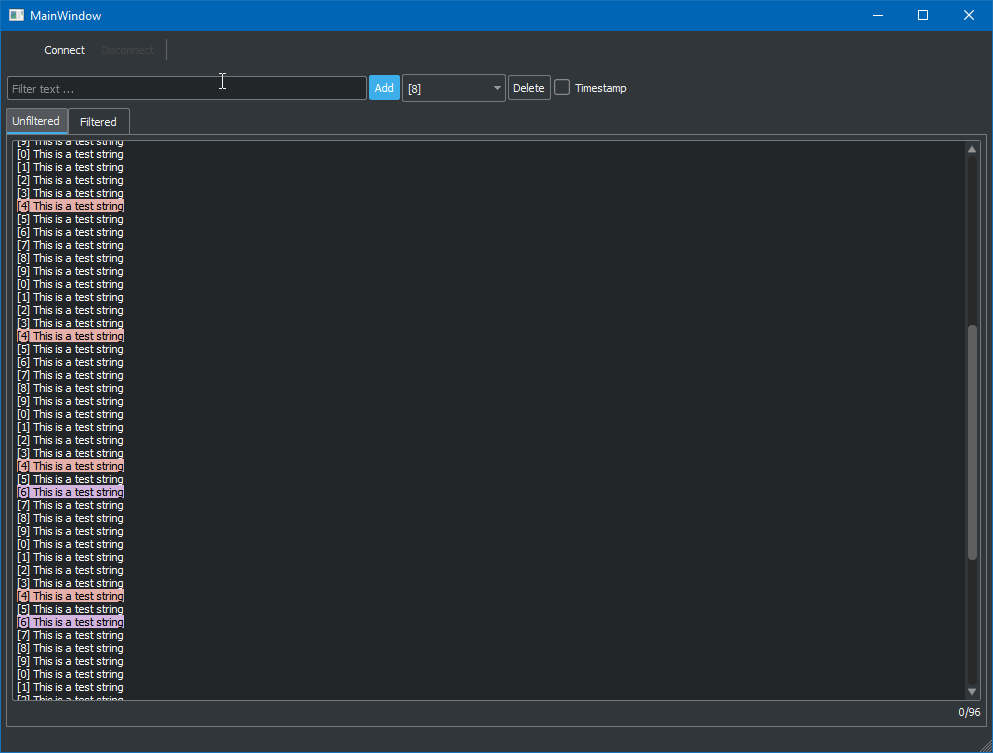

# Serial Port Filter

This is a Windows application that displays real time data from serial port. They can be highlighted and filtered to help debugging.

## Features

- Show or hide timestamp
- Add multiple filters
- View the whole data or only the filtered data

## Screenshot

### Known issue

- Icons aren't properly working
- Need to fix QtextEdit margin to fit the tabs

### Upcoming features

- Possibility to add a tab with a certain filter
- Max scrollback configuration ( at this moment it's unlimited and can slowdown the software when running for a while )